# How to log into Office 365 account for the first time?

## Temporary passwords

- You will be sent an email with the temporary password as shown in the image below.

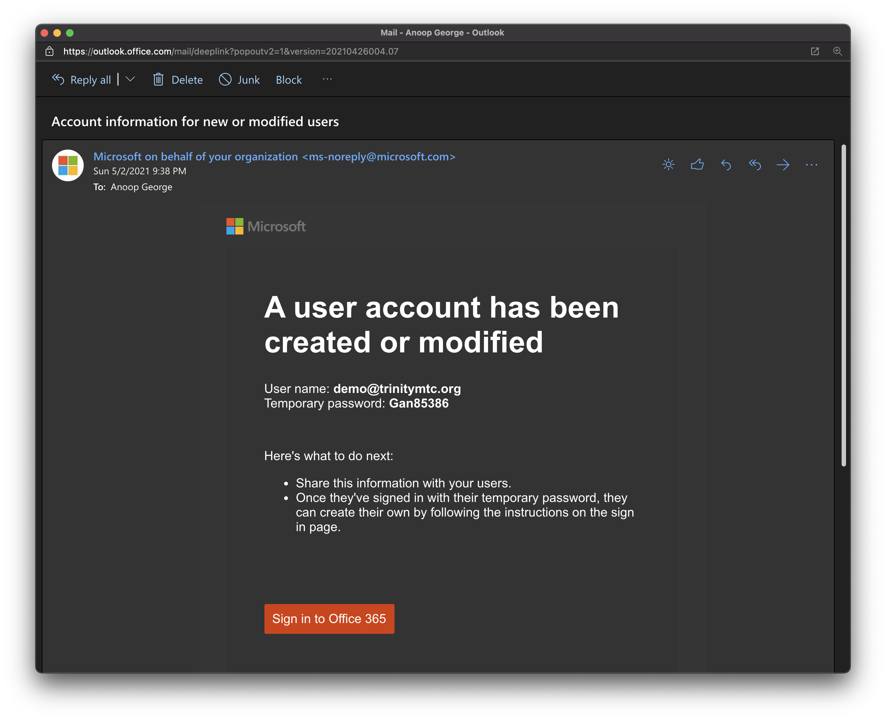

- Click on the "Sign in to Office 365" button in the email.

## Sign in to the Office 365 account for the first time

- enter the temporary password from the email in the sign in window and click next. The

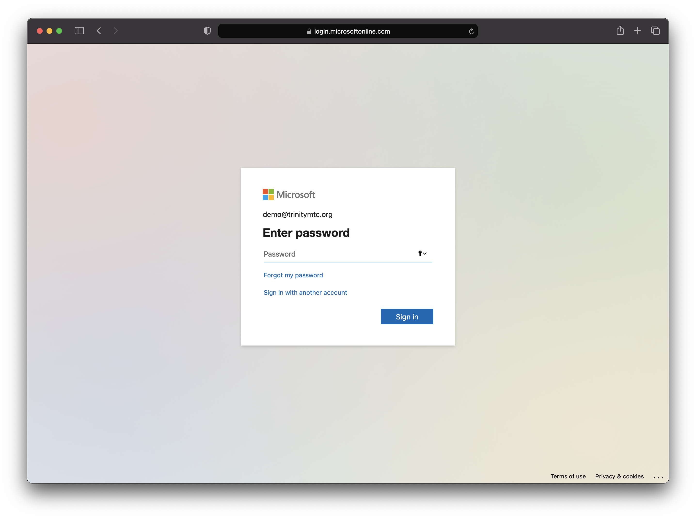

- click next on the screen titled "more information is required"

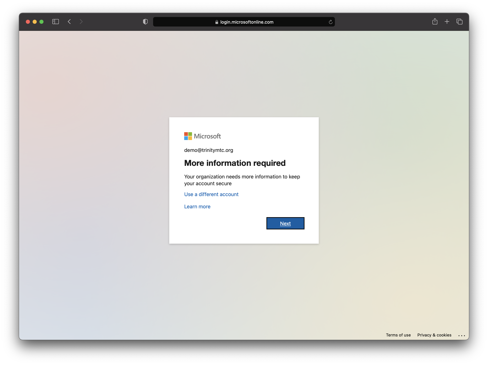

- On the keep your account secure screen, select "I want to setup a differnt method" link as highlighted in the image below.

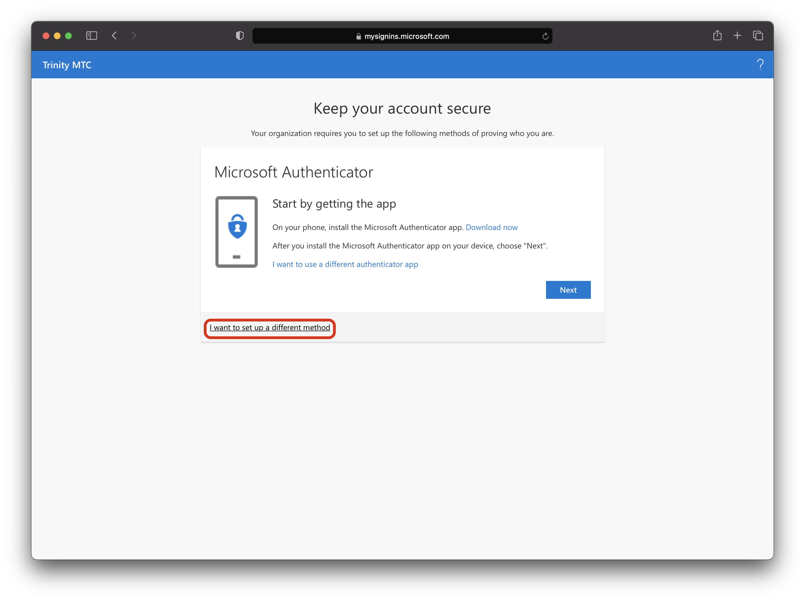

- Select Phone from the dropdown and click confirm

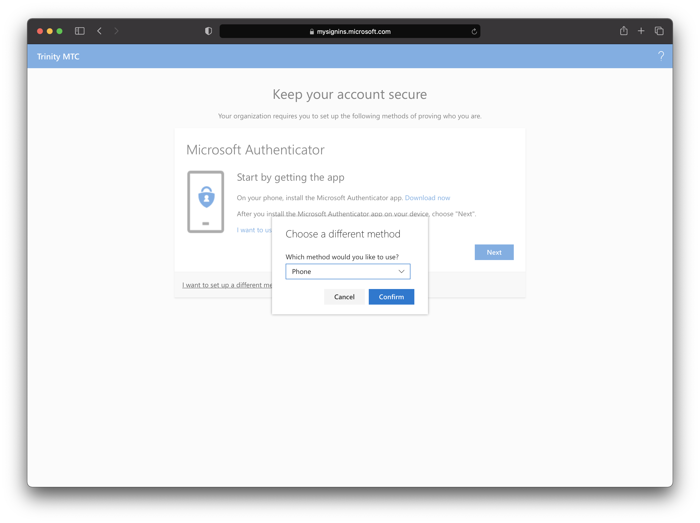

- Enter your mobile phone number and click next.

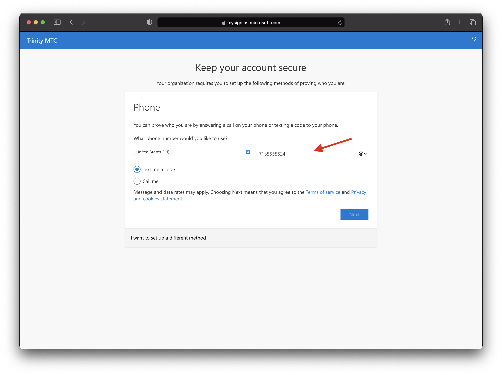

- Enter the six digit code that is send to the phone and click next

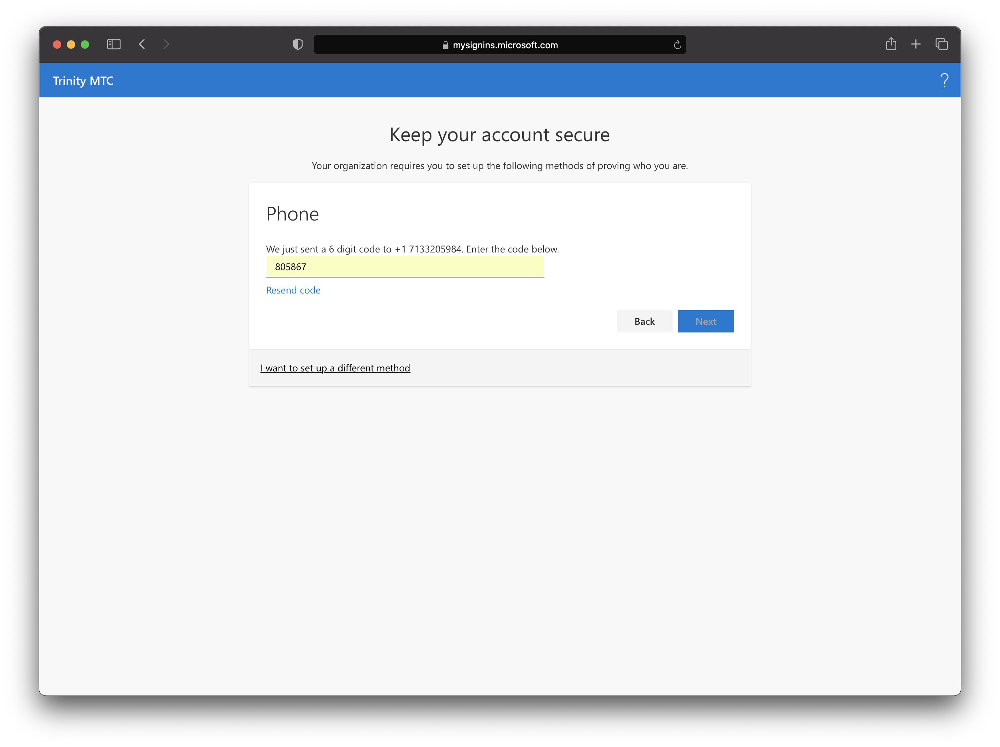

- Click next to continue.

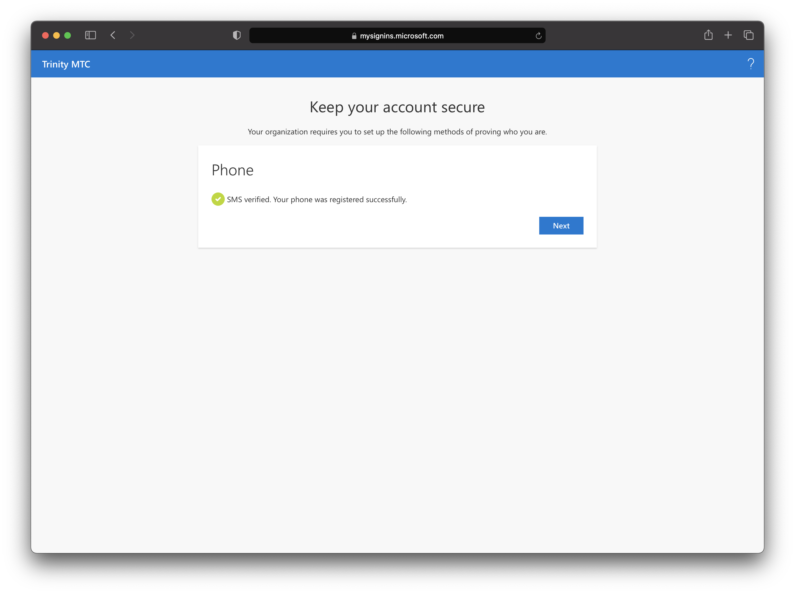

- Click done.

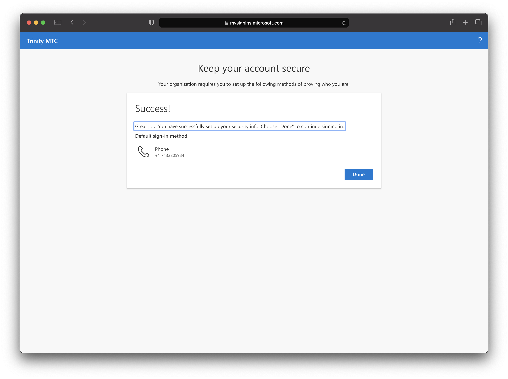

- Enter the temporary password from the email and enter a new password and click next.

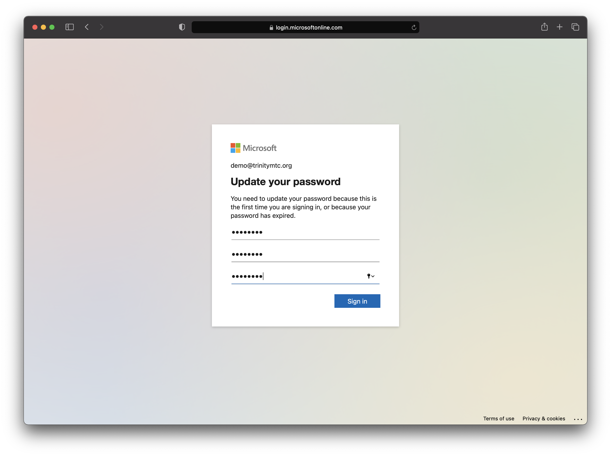

- In the "Stay signed in" page, check the "don't show this again" and click yes

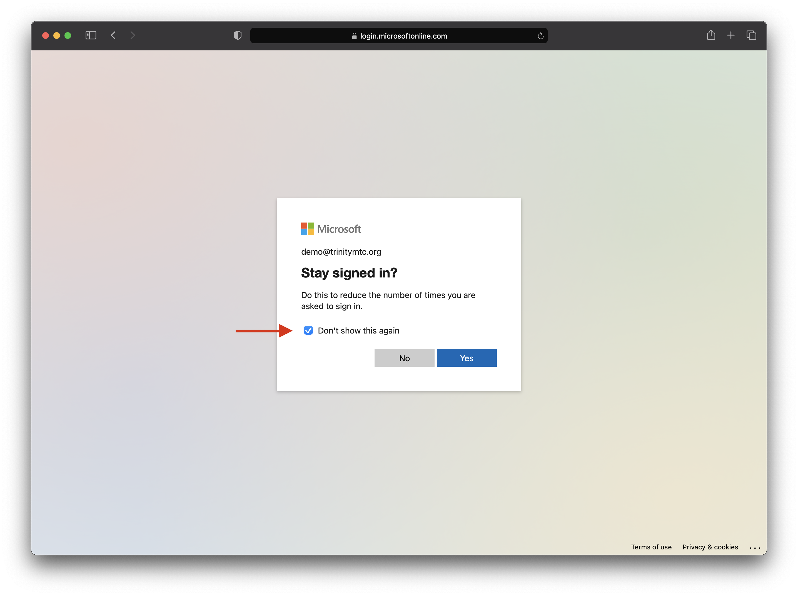
